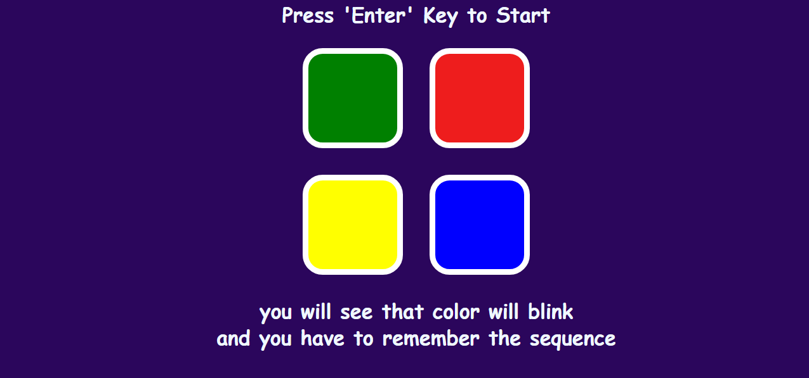

# So hey , Do you want to test your memory , that for how long you can keep the sequence in your mind?

## Lets give a try to this "Memory popper" game made by me .

# All you have to remember the color blinks and follow the sequence , for example if the first color blinks is red , than yellow . So the sequence will be red -> yellow so select that.

## once the player chose wrong color he get Eliminated and again game starts.

 
